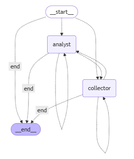

#  Agentic Company Intelligence System

A **multi-agent financial research system** built using **LangGraph**, **LangChain**, **Groq LLM**, **FastAPI**, and **Streamlit**, with **Opik (Comet) monitoring** for observability.

The system orchestrates specialized agents to collect live stock data and news, analyze risks, and produce an investment verdict in a structured, reproducible way.

---

##  Key Features

- **Multi-Agent Orchestration** using LangGraph
- **Supervisor Agent** for dynamic routing
- **Live Stock & News Fetching** (Yahoo Finance + DuckDuckGo)
- **Structured Outputs** using Pydantic models
- **Session-based Memory** using LangGraph `MemorySaver`
- **FastAPI Backend** for agent execution
- **Streamlit UI** for interactive usage
- **Opik (Comet) Monitoring** for tracing & observability

---

## Project structure

```
intelagentsys/
│
├── src/
│   ├── graph.py            # LangGraph 
│   ├── nodes.py            # Agent logic 
│   ├── state.py            # Pydantic models + AgentState
│   ├── data/
│   │   └── mock_db.py      # Mock fallback data
│
├── main.py                 # FastAPI backend
├── streamlit_ui.py         # Streamlit frontend
├── .env                    
├── requirements.txt
└── README.md
```


---

## Agent Responsibilities

### Agent flowchart




### Supervisor Agent
- Decides **which agent runs next**
- Ensures correct execution order
- Ends workflow once analysis is complete

### Data Collector Agent
- Fetches:
  - Live stock price via **Yahoo Finance**
  - Latest business news via **DuckDuckGo**
- Falls back to **mock data** if APIs fail
- Outputs a structured `CompanyResearchDoc`

### Analyst Agent
- Consumes only collected data
- Generates:
  - Summary
  - Key risks
  - Investment verdict (Buy / Hold / Sell)
- Uses **structured LLM output** (Pydantic)

---

## State & Memory Design

### AgentState (Graph Memory)

```python
class AgentState(TypedDict):
    messages: List[dict]
    company_name: str
    research_data: Optional[CompanyResearchDoc]
    final_report: Optional[AnalystReport]
```


## Setup Instruction 
### clone repository 
```
git clone https://github.com/Nishanthan15me104/soulpage-genai-assignment-nishanthan.git
cd soulpage-genai-assignment-nishanthan\intelagentsys
```
### Create Virtual Environment

```
python -m venv venv
source venv/bin/activate      # Linux / Mac
venv\Scripts\activate         # Windows
```
### Install Dependencies

```
pip install -r requirements.txt
```

### Environment Variables
```
GROQ_API_KEY=your_groq_api_key
COMET_API_KEY=your_comet_api_key   # Optional (for Opik)
OPIK_PROJECT_NAME=agentic-research # Optional
```
### Running the Application

Start FastAPI Backend
```
uvicorn main:server --reload     
```
### Start Streamlit UI (New Terminal)

```
streamlit run streamlit_ui.py
```

## example usecase
